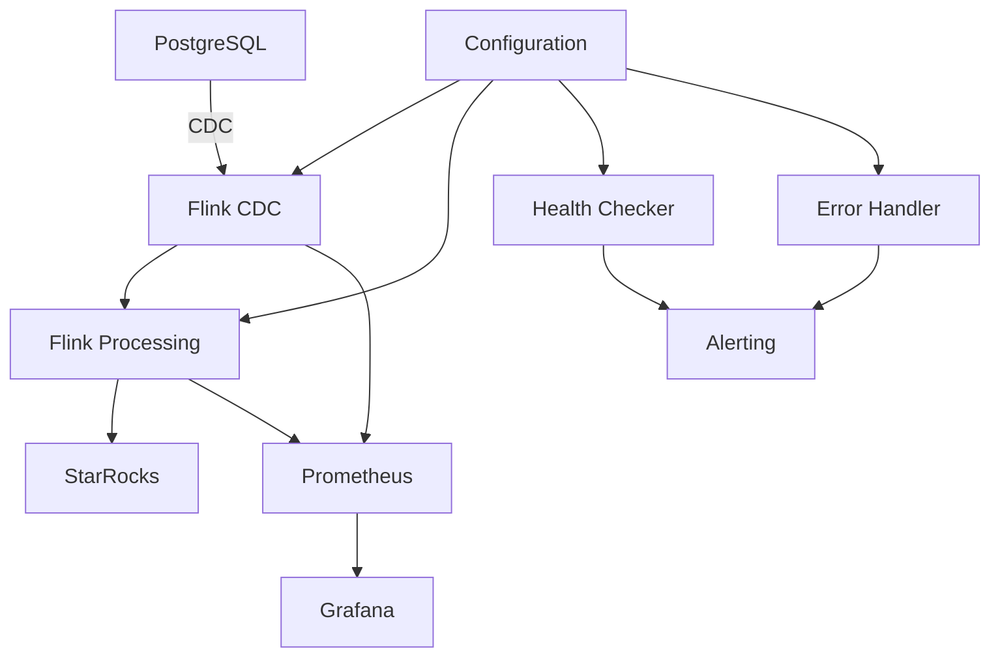

# PostgreSQL to StarRocks Real-time Data Sync with Flink CDC

A comprehensive, production-ready solution for real-time data synchronization from PostgreSQL to StarRocks using Apache Flink CDC (Change Data Capture). This project includes both a simple demo implementation and a full production system with monitoring, error handling, and deployment automation.

## 🚀 Quick Start

### Demo (2x2 Tables)
```bash
# Clone and start demo
git clone <repository-url>
cd postgres-starrocks-sync
make quick-demo

# Access services
# Health: http://localhost:8080/health
# Metrics: http://localhost:9090/metrics
# Flink UI: http://localhost:8081
```

### Production
```bash
# Deploy with Docker Compose
make prod-deploy

# Or deploy to Kubernetes
make prod-k8s
```

## 📁 Project Structure

```
├── demo/                          # Simple 2x2 table demo
│   ├── src/                       # Demo source code
│   ├── config/                    # Demo configuration
│   ├── init-scripts/              # Database initialization
│   ├── docker-compose.yml         # Demo services
│   └── Dockerfile                 # Demo container
├── production/                    # Full production implementation
│   ├── src/                       # Production source code
│   ├── config/                    # Production configuration
│   ├── deployment/                # Deployment scripts
│   │   ├── docker-compose.yml     # Production services
│   │   ├── k8s/                   # Kubernetes manifests
│   │   ├── monitoring/            # Monitoring configs
│   │   └── scripts/               # Deployment scripts
│   └── requirements.txt           # Production dependencies
├── docs/                          # Comprehensive documentation
│   ├── demo-setup.md             # Demo setup guide
│   ├── production-deployment.md   # Production deployment
│   ├── configuration.md           # Configuration reference
│   ├── monitoring.md              # Monitoring guide
│   └── troubleshooting.md         # Troubleshooting guide
├── requirements.txt               # Base dependencies
├── Makefile                       # Development commands
└── README.md                      # This file
```

## ✨ Features

### Demo Version
- **Simple Setup:** 2x2 table synchronization (users, orders)
- **Docker Compose:** Easy local testing
- **Basic Monitoring:** Health checks and metrics
- **Quick Start:** Get running in minutes

### Production Version
- **🔄 Real-time Sync:** Change Data Capture (CDC) with Flink
- **📊 Comprehensive Monitoring:** Prometheus, Grafana, health checks
- **🛡️ Error Handling:** Retry mechanisms, dead letter queues, alerting
- **🚀 Deployment:** Docker Compose and Kubernetes support
- **📈 Performance:** Configurable parallelism, checkpointing, optimization
- **🔒 Security:** SSL support, audit logging, secret management
- **📝 Observability:** Structured logging, metrics, tracing
- **⚙️ Configuration:** Environment-based config with validation

## 🏗️ Architecture



## 🛠️ Technology Stack

- **Stream Processing:** Apache Flink 1.16
- **Databases:** PostgreSQL 13+, StarRocks 2.0+
- **Monitoring:** Prometheus, Grafana
- **Deployment:** Docker, Kubernetes
- **Language:** Python 3.8+
- **CDC:** Flink CDC Connectors

## 📋 Requirements

### System Requirements
- **CPU:** 4+ cores (8+ recommended for production)
- **Memory:** 8GB+ RAM (16GB+ recommended for production)
- **Storage:** 50GB+ available disk space
- **Network:** Stable connectivity between components

### Software Requirements
- **Docker:** 20.10+ and Docker Compose 2.0+
- **Kubernetes:** 1.20+ (for K8s deployment)
- **Python:** 3.8+
- **Java:** 11+ (for Flink)

## 🚀 Getting Started

### 1. Demo Setup
```bash
# Quick demo start
make quick-demo

# Or manual setup
cd demo
docker-compose up -d
```

### 2. Production Deployment
```bash
# Docker Compose deployment
make prod-deploy

# Kubernetes deployment
make prod-k8s
```

### 3. Verify Installation
```bash
# Check health
curl http://localhost:8080/health

# View metrics
curl http://localhost:9090/metrics

# Access Grafana
open http://localhost:3000  # admin/admin
```

## 📊 Monitoring & Observability

### Health Checks
- **Application Health:** `/health`
- **Readiness:** `/health/ready`
- **Liveness:** `/health/live`
- **Detailed Status:** `/health/detailed`

### Metrics
- **Processing Metrics:** Records processed, failed, latency
- **System Metrics:** CPU, memory, disk usage
- **Business Metrics:** Throughput, lag, data freshness
- **Flink Metrics:** Checkpoints, backpressure, job status

### Dashboards
- **Application Overview:** System health and performance
- **Database Monitoring:** Connection status and performance
- **Flink Monitoring:** Job status and metrics
- **Business Metrics:** Data sync status and trends

## ⚙️ Configuration

### Environment Variables
```bash
# Database Configuration
POSTGRES_HOST=localhost
POSTGRES_DB=production_db
POSTGRES_USER=postgres
POSTGRES_PASSWORD=password

STARROCKS_HOST=localhost
STARROCKS_DB=production_db
STARROCKS_USER=root
STARROCKS_PASSWORD=root

# Monitoring
METRICS_PORT=9090
HEALTH_CHECK_PORT=8080

# Logging
LOG_LEVEL=INFO
LOG_JSON_FORMAT=true
```

### Configuration Files
- **Demo:** `demo/config/demo_config.yaml`
- **Production:** `production/config/production_config.yaml`

## 🔧 Development

### Available Commands
```bash
# Demo commands
make demo-start      # Start demo
make demo-stop       # Stop demo
make demo-logs       # View logs

# Production commands
make prod-build      # Build image
make prod-deploy     # Deploy production
make prod-k8s        # Deploy to Kubernetes

# Development commands
make install         # Install dependencies
make test            # Run tests
make lint            # Run linting
make format          # Format code
```

### Testing
```bash
# Run tests
make test

# Run specific tests
pytest tests/test_sync.py -v

# Coverage report
pytest --cov=src --cov-report=html
```

## 📚 Documentation

- **[Demo Setup Guide](docs/demo-setup.md)** - Get started with the demo
- **[Production Deployment](docs/production-deployment.md)** - Deploy to production
- **[Configuration Reference](docs/configuration.md)** - Complete config guide
- **[Monitoring Guide](docs/monitoring.md)** - Monitoring and observability
- **[Troubleshooting](docs/troubleshooting.md)** - Common issues and solutions

## 🚨 Troubleshooting

### Common Issues
1. **Services not starting:** Check Docker and port availability
2. **Database connection issues:** Verify credentials and network
3. **Flink job failures:** Check Flink UI and logs
4. **Data sync issues:** Verify table schemas and CDC configuration

### Debug Commands
```bash
# Check service status
docker-compose ps

# View logs
docker-compose logs -f sync-app

# Check health
curl http://localhost:8080/health/detailed

# Monitor resources
docker stats
```

## 🤝 Contributing

1. Fork the repository
2. Create a feature branch
3. Make your changes
4. Add tests
5. Submit a pull request

## 📄 License

This project is licensed under the MIT License - see the LICENSE file for details.

## 🆘 Support

- **Documentation:** Check the docs/ directory
- **Issues:** GitHub Issues
- **Discussions:** GitHub Discussions
- **Troubleshooting:** See troubleshooting.md

## 🎯 Roadmap

- [ ] Additional database connectors
- [ ] Advanced data transformation
- [ ] Multi-region deployment
- [ ] Enhanced monitoring dashboards
- [ ] Performance optimization tools
- [ ] Automated testing suite
