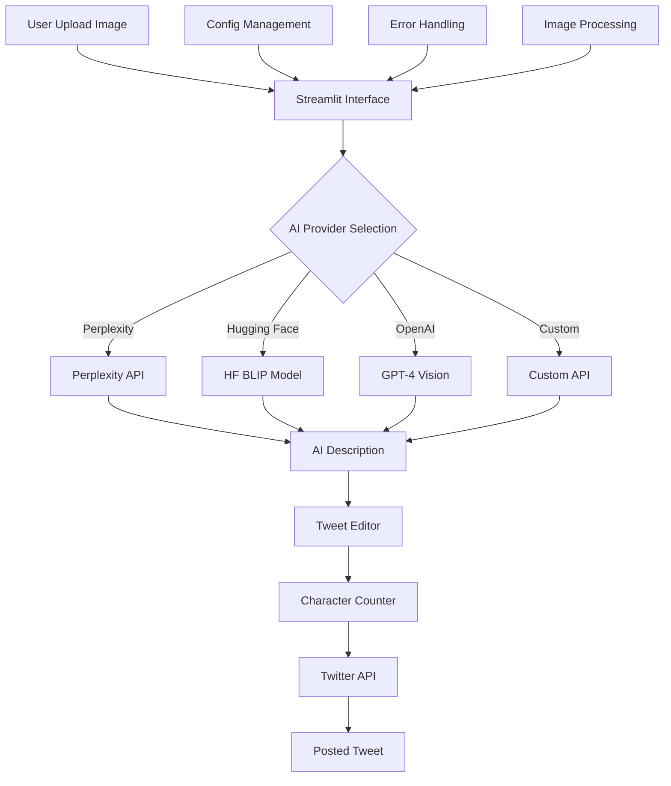

# 🐦 AI Tweet Generator Bot

A powerful, AI-driven Streamlit application that automatically generates engaging tweets from uploaded images and posts them directly to Twitter. This bot leverages multiple AI providers to create compelling social media content with just a few clicks.

## ✨ Features

- **📸 Multi-format Image Support**: Upload PNG, JPG, JPEG, or GIF images
- **🤖 Multiple AI Providers**: 
  - **Perplexity AI** (Recommended): High-quality descriptions with fast response times
  - **Hugging Face** (Free): BLIP model for image captioning
  - **OpenAI** (Premium): GPT-4 Vision for sophisticated descriptions
  - **Custom API**: Support for your own AI endpoints
- **✍️ Smart Tweet Editing**: Edit generated content before posting
- **🐦 Direct Twitter Integration**: Post tweets with images instantly
- **📊 Real-time Character Counter**: Stay within Twitter's 280-character limit
- **🎨 Modern UI/UX**: Beautiful, responsive Streamlit interface
- **🔒 Secure Configuration**: Multiple ways to manage API credentials

## 🏗️ Architecture



## 🚀 Quick Start

### 1. Clone the Repository
```bash
git clone https://github.com/akshaysalvi948/Complaint-Gram.git
cd Complaint-Gram
```

### 2. Install Dependencies
```bash
pip install -r requirements.txt
```

### 3. Set Up Twitter API Credentials

#### Option A: Environment Variables (Recommended)
1. Copy the example file:
   ```bash
   cp config.env.example config.env
   ```

2. Edit `config.env` with your actual credentials:
   ```env
   TWITTER_API_KEY=your_actual_api_key
   TWITTER_API_SECRET=your_actual_api_secret
   TWITTER_ACCESS_TOKEN=your_actual_access_token
   TWITTER_ACCESS_TOKEN_SECRET=your_actual_access_token_secret
   
   # Optional AI API keys
   PERPLEXITY_API_KEY=your_perplexity_api_key
   HUGGINGFACE_TOKEN=your_huggingface_token
   OPENAI_API_KEY=your_openai_api_key
   ```

#### Option B: Streamlit Secrets (For Deployment)
1. Create `.streamlit/secrets.toml`:
   ```toml
   [twitter]
   api_key = "your_actual_api_key"
   api_secret = "your_actual_api_secret"
   access_token = "your_actual_access_token"
   access_token_secret = "your_actual_access_token_secret"
   
   [ai]
   perplexity_api_key = "your_perplexity_api_key"
   huggingface_token = "your_huggingface_token"
   openai_api_key = "your_openai_api_key"
   ```

### 4. Get Twitter API Access

1. **Apply for Twitter Developer Account**:
   - Visit [Twitter Developer Portal](https://developer.twitter.com/)
   - Apply for a developer account (usually approved within 24-48 hours)

2. **Create a Twitter App**:
   - Create a new project and app
   - Set permissions to "Read and Write"
   - Generate API keys and access tokens

3. **Required Permissions**:
   - ✅ Read and Write permissions
   - ✅ Media upload permissions

### 5. Run the Application
```bash
streamlit run app.py
```

The app will open at `http://localhost:8501`

## 🎯 How to Use

1. **🔧 Configure APIs**: 
   - Enter Twitter credentials in the sidebar
   - Choose your preferred AI provider
   - Add AI API keys if using premium services

2. **📸 Upload Image**: 
   - Drag and drop or browse for an image file
   - Supported formats: PNG, JPG, JPEG, GIF

3. **🤖 Generate Tweet**: 
   - Click "Generate Tweet" to create AI description
   - Wait for AI processing (usually 2-10 seconds)

4. **✏️ Edit Content**: 
   - Review the generated tweet
   - Edit text as needed
   - Monitor character count (280 limit)

5. **🚀 Post Tweet**: 
   - Click "Post Tweet" to publish
   - View success confirmation with tweet link

## 🔧 AI Provider Configuration

### Perplexity AI (Recommended)
- **Model**: Sonar Pro with vision capabilities
- **Strengths**: Fast, engaging social media descriptions
- **Cost**: Pay-per-use (~$0.002 per request)
- **Setup**: Get API key from [Perplexity](https://www.perplexity.ai/)

### Hugging Face (Free Tier)
- **Model**: Salesforce BLIP image captioning
- **Strengths**: Free usage, good for basic descriptions
- **Limitations**: Rate limits, simpler descriptions
- **Setup**: Optional token from [Hugging Face](https://huggingface.co/)

### OpenAI (Premium)
- **Model**: GPT-4 Vision
- **Strengths**: Most sophisticated, contextual descriptions
- **Cost**: Pay-per-use (~$0.01-0.03 per request)
- **Setup**: API key from [OpenAI](https://platform.openai.com/)

### Custom API
- **Flexibility**: Use your own AI model
- **Requirements**: 
  - POST endpoint accepting JSON
  - Expected format: `{"image": "base64_string", "prompt": "describe_image"}`
  - Response format: `{"description": "generated_text"}` or `{"text": "generated_text"}`

## 📁 Project Structure

```
TweeterBot/
├── app.py                    # Main Streamlit application
├── requirements.txt          # Python dependencies
├── config.env.example       # Environment variables template
├── env.template             # Alternative env template
├── secrets.toml.example     # Streamlit secrets template
├── .gitignore              # Git ignore rules
└── README.md               # This documentation
```

## 🛠️ Technical Stack

### Core Technologies
- **Frontend**: Streamlit 1.28+
- **Backend**: Python 3.8+
- **Image Processing**: Pillow (PIL)
- **HTTP Requests**: requests library
- **Twitter Integration**: tweepy 4.14+

### AI Integration
- **Perplexity**: Direct API calls
- **Hugging Face**: Transformers pipeline
- **OpenAI**: Official Python client
- **Custom**: Flexible API integration

### Security & Configuration
- **Environment Management**: python-dotenv
- **Secrets Management**: Streamlit secrets
- **API Key Protection**: Multiple security layers

## 🔒 Security Best Practices

### API Key Management
- ✅ Never commit API keys to version control
- ✅ Use environment variables or Streamlit secrets
- ✅ Rotate keys regularly
- ✅ Monitor API usage and costs

### Image Handling
- ✅ Images processed locally and temporarily
- ✅ No permanent storage of uploaded images
- ✅ Automatic cleanup after processing

### Error Handling
- ✅ Graceful API failure handling
- ✅ User-friendly error messages
- ✅ Rate limit awareness
- ✅ Input validation and sanitization

## 🚀 Deployment Options

### Local Development
```bash
streamlit run app.py
```

### Streamlit Cloud (Free)
1. Push code to GitHub
2. Connect to [Streamlit Cloud](https://streamlit.io/cloud)
3. Add secrets in the dashboard
4. Deploy with one click

### Heroku
```bash
# Create Procfile
echo "web: streamlit run app.py --server.port=$PORT --server.address=0.0.0.0" > Procfile

# Deploy
heroku create your-app-name
heroku config:set TWITTER_API_KEY=your_key
# ... add other config vars
git push heroku main
```

### Docker
```dockerfile
FROM python:3.9-slim

WORKDIR /app
COPY requirements.txt .
RUN pip install -r requirements.txt

COPY . .
EXPOSE 8501

CMD ["streamlit", "run", "app.py", "--server.address", "0.0.0.0"]
```

## 🐛 Troubleshooting

### Common Issues

#### Twitter API Errors
- **401 Unauthorized**: Check API credentials
- **403 Forbidden**: Verify app permissions (Read + Write)
- **429 Rate Limited**: Wait before retrying
- **Media upload failed**: Check image size/format

#### AI Generation Issues
- **Slow responses**: Try different AI provider
- **API errors**: Verify API keys and quotas
- **Poor descriptions**: Experiment with different providers

#### Application Issues
- **Streamlit errors**: Check Python version (3.8+)
- **Import errors**: Reinstall requirements
- **Config issues**: Verify environment variable names

### Debug Steps
1. **Check logs**: Look at Streamlit console output
2. **Test APIs**: Verify credentials work independently
3. **Image validation**: Ensure images are valid format
4. **Network**: Check internet connectivity

### Getting Help
- 📖 Check this README thoroughly
- 🐛 Search existing GitHub issues
- 💬 Create new issue with error details
- 📧 Include relevant logs (without API keys!)

## 📊 Performance & Limits

### API Rate Limits
- **Twitter**: 300 tweets per 15-minute window
- **Perplexity**: Varies by plan
- **OpenAI**: Varies by tier
- **Hugging Face**: 1000 requests/hour (free)

### Recommended Usage
- **Development**: Use Hugging Face for testing
- **Production**: Perplexity for best balance
- **High-volume**: Consider custom API solution

### Image Specifications
- **Max size**: 5MB (Twitter limit)
- **Formats**: PNG, JPG, JPEG, GIF
- **Dimensions**: Up to 4096x4096 pixels

## 🤝 Contributing

We welcome contributions! Here's how to get started:

### Development Setup
```bash
# Fork and clone the repository
git clone https://github.com/yourusername/Complaint-Gram.git
cd Complaint-Gram

# Create virtual environment
python -m venv venv
source venv/bin/activate  # On Windows: venv\Scripts\activate

# Install dependencies
pip install -r requirements.txt

# Run tests (if available)
python -m pytest

# Start development server
streamlit run app.py
```

### Contribution Guidelines
1. **Fork** the repository
2. **Create** a feature branch (`git checkout -b feature/amazing-feature`)
3. **Commit** your changes (`git commit -m 'Add amazing feature'`)
4. **Push** to the branch (`git push origin feature/amazing-feature`)
5. **Open** a Pull Request

### Areas for Contribution
- 🔧 Additional AI providers
- 🎨 UI/UX improvements
- 📊 Analytics and metrics
- 🧪 Testing framework
- 📚 Documentation improvements
- 🌐 Internationalization

## 📄 License

This project is licensed under the MIT License - see the [LICENSE](LICENSE) file for details.

## ⚠️ Disclaimer

- **Educational Purpose**: This tool is for learning and personal use
- **Responsible Use**: Follow Twitter's Terms of Service
- **Content Guidelines**: Ensure posted content is appropriate
- **API Costs**: Monitor usage to avoid unexpected charges
- **Rate Limits**: Respect platform rate limits

## 🙏 Acknowledgments

- **Streamlit Team**: For the amazing web framework
- **Twitter API**: For social media integration
- **AI Providers**: Perplexity, OpenAI, Hugging Face for AI capabilities
- **Open Source Community**: For inspiration and support

## 📞 Support

- **Documentation**: This README and inline code comments
- **Issues**: [GitHub Issues](https://github.com/akshaysalvi948/Complaint-Gram/issues)
- **Discussions**: [GitHub Discussions](https://github.com/akshaysalvi948/Complaint-Gram/discussions)

---

**Built with ❤️ for the AI and social media community**

*Last updated: October 2024*